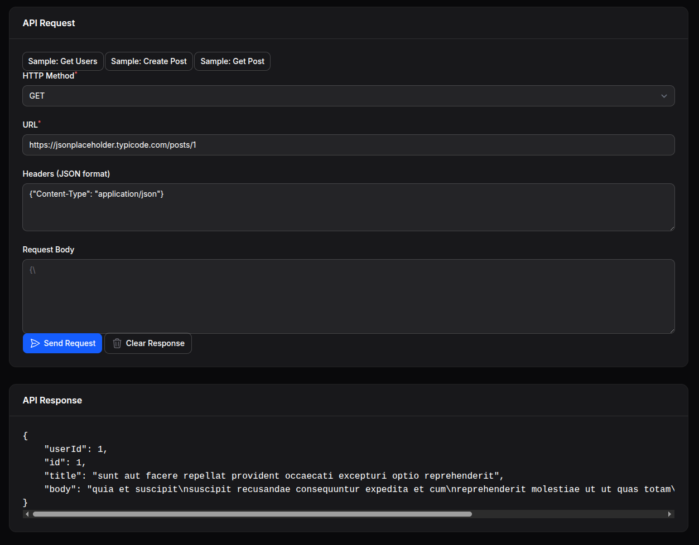

# Filaforge API Explorer

A Filament v4 panel plugin that adds an API Explorer page for testing H## Usage

After installation and registration, you'll find the "API Explorer" page in your Filament panel navigation. The page provides:

- **URL Input**: Enter the API endpoint you want to test
- **HTTP Method Selection**: Choose GET, POST, PUT, DELETE, etc.
- **Headers Management**: Add custom headers for authentication or content-type
- **Request Body**: For POST/PUT requests, provide JSON or form data
- **Response Display**: View the API response with syntax highlighting
- **History**: Keep track of your recent API calls

Navigate to your Filament panel and look for "API Explorer" in the sidebar to start testing your APIs.

## Configuration

No additional configuration is required. The plugin works out of the box after installation.

## Features

- ✅ Full HTTP method support (GET, POST, PUT, DELETE, PATCH, etc.)
- ✅ Custom headers management
- ✅ Request body support for JSON and form data
- ✅ Response syntax highlighting
- ✅ Request history
- ✅ Clean, intuitive interface matching Filament's design

---

**Package**: `filaforge/api-explorer`  
**License**: MIT  
**Requirements**: PHP ^8.1, Laravel ^12, Filament ^4.0s (similar to Postman) inside your admin panel.



## Requirements
- PHP >= 8.1
- Laravel 12 (illuminate/support ^12)
- Filament ^4.0

## Installation

### Step 1: Install via Composer
```bash
composer require filaforge/api-explorer
```

### Publish (optional)

```bash
php artisan vendor:publish --provider="Filaforge\\ApiExplorer\\Providers\\ApiExplorerServiceProvider"
```

### Step 2: Service Provider Registration
The service provider is auto-discovered, so no manual registration is required.

### Step 3: Register the Plugin in Your Panel
Add the plugin to your Filament panel configuration in `app/Providers/Filament/AdminPanelProvider.php` (or your custom panel provider):

```php
<?php

namespace App\Providers\Filament;

use Filament\Http\Middleware\Authenticate;
use Filament\Http\Middleware\DisableBladeIconComponents;
use Filament\Http\Middleware\DispatchServingFilamentEvent;
use Filament\Pages;
use Filament\Panel;
use Filament\PanelProvider;
use Filament\Support\Colors\Color;
use Filament\Widgets;
use Illuminate\Cookie\Middleware\AddQueuedCookiesToResponse;
use Illuminate\Cookie\Middleware\EncryptCookies;
use Illuminate\Foundation\Http\Middleware\VerifyCsrfToken;
use Illuminate\Routing\Middleware\SubstituteBindings;
use Illuminate\Session\Middleware\AuthenticateSession;
use Illuminate\Session\Middleware\StartSession;
use Illuminate\View\Middleware\ShareErrorsFromSession;

// Add this import
use Filaforge\ApiExplorer\ApiExplorerPlugin;

class AdminPanelProvider extends PanelProvider
{
    public function panel(Panel $panel): Panel
    {
        return $panel
            ->default()
            ->id('admin')
            ->path('admin')
            ->login()
            ->colors([
                'primary' => Color::Amber,
            ])
            ->discoverResources(in: app_path('Filament/Resources'), for: 'App\\Filament\\Resources')
            ->discoverPages(in: app_path('Filament/Pages'), for: 'App\\Filament\\Pages')
            ->pages([
                Pages\Dashboard::class,
            ])
            ->discoverWidgets(in: app_path('Filament/Widgets'), for: 'App\\Filament\\Widgets')
            ->widgets([
                Widgets\AccountWidget::class,
                Widgets\FilamentInfoWidget::class,
            ])
            ->middleware([
                EncryptCookies::class,
                AddQueuedCookiesToResponse::class,
                StartSession::class,
                AuthenticateSession::class,
                ShareErrorsFromSession::class,
                VerifyCsrfToken::class,
                SubstituteBindings::class,
                DisableBladeIconComponents::class,
                DispatchServingFilamentEvent::class,
            ])
            ->authMiddleware([
                Authenticate::class,
            ])
            // Add the plugin here
            ->plugin(ApiExplorerPlugin::make())
            ->plugin(\Filaforge\DeepseekChat\Providers\DeepseekChatPanelPlugin::make())
            ->plugin(\Filaforge\HuggingfaceChat\Providers\HfChatPanelPlugin::make())
            ->plugin(\Filaforge\ChatAi\Providers\ChatAiPanelPlugin::make())
            ->plugin(\Filaforge\UserManager\UserManagerPlugin::make())
            ->plugin(\Filaforge\TerminalConsole\TerminalConsolePlugin::make())
            ->plugin(\Filaforge\OpensourceChat\OpensourceChatPlugin::make())
            ->plugin(\Filaforge\DatabaseViewer\DatabaseViewerPlugin::make())
            ->plugin(\Filaforge\DatabaseQuery\DatabaseQueryPlugin::make())
            ->plugin(\Filaforge\SystemPackages\SystemPackagesPlugin::make())
            ->plugin(\Filaforge\TerminalConsole\TerminalConsolePlugin::make())
            ->plugin(\Filaforge\ApiExplorer\ApiExplorerPlugin::make())
            ->plugin(\Filaforge\SystemMonitor\SystemMonitorPlugin::make())
            ->plugin(\Filaforge\HelloWidget\HelloWidgetPlugin::make())
            ->plugin(\Filaforge\OllamaChat\Filament\OllamaChatPanelPlugin::make());
    }
}
```

### Step 4: Clear Cache and Discover Assets
```bash
php artisan config:clear
php artisan route:clear
php artisan view:clear
```

## Usage
After registering, the plugin adds an API Explorer page to your panel. The exact URL depends on your panel path and navigation. Open your panel and look for “API Explorer”.

## Configuration
No configuration is required.

---
Package: `filaforge/api-explorer`## Filaforge API Explorer

A Filament plugin that provides a simple API testing page similar to Postman, with lazy‑loaded CSS assets.

Usage:

- Register in your panel provider:

```php
->plugin(\Filaforge\ApiExplorer\ApiExplorerPlugin::make())
```

The page appears as "API Explorer" in the admin navigation.


